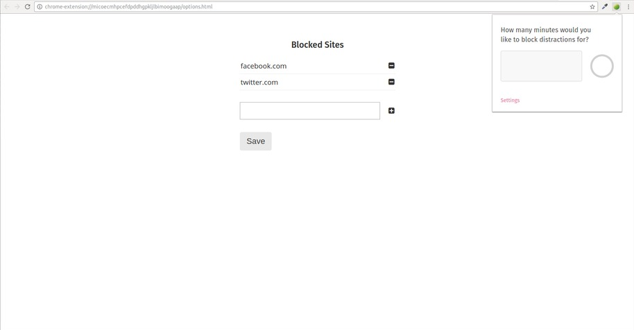
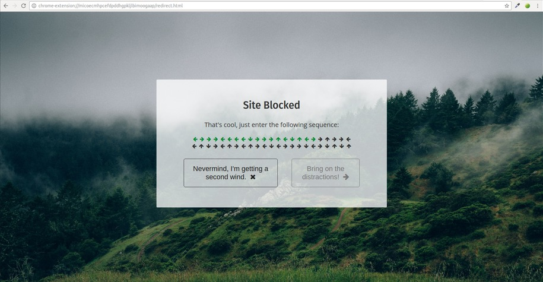

# Focusly

[Download from the Chrome Store][store-link]
[store-link]: https://chrome.google.com/webstore/search/focusly

## Summary

Focusly is a Chrome Extension that allows users to limit their access to distracting sites.

Users can:

<b>Create a list of hosts</b>
- [x] Add hosts to the list
- [x] Remove hosts from the list
- [x] Save the list

<b>Create a timer</b>
- [x] Set a period of time to block sites for
- [x] End the timer early by inputing a set of characters

Focusly allows users to end the timer early and access distracting sites before the set time ends, however, to discourage quitting early, users must first input a series of characters, which takes about 30 seconds to complete.

## Screenshots

Options page to add and remove blocked hosts, and the extension pop-up in upper right corner:

Interactive input sequence to end the timer early:

## Technology

The extension is written using HTML, CSS, and javascript, and utilizes the Chrome Extension API.

The application listens for HTTP requests made by the user and compares them to the user's list of blocked sites. If the timer is active and the host of the HTTP request matches a site on the list, the request is blocked.

The user can choose to end the timer early, however, they must first enter a series of arrow inputs. The input sequence is randomized and dynamically rendered each time.

### Future Implementation

In the future, an improvements I would like to make to the extension are:

- [ ] Add the ability for the user to create a list of resources that are conducive to focusing.
